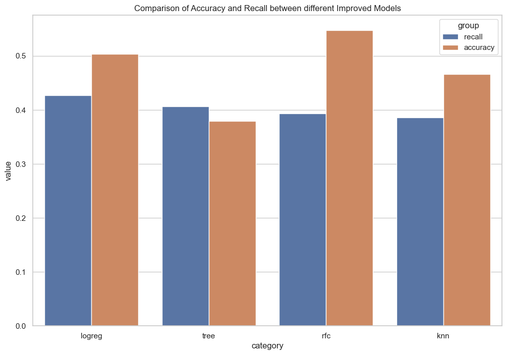

#  Predicting Readmission Rates of Diabetic Patients: A Machine Learning Approach
Author: Diana Nduta Mwaura

## Overview

Poor readmission rates increases the risk of potential patients diverting to other facilities. The purpose of this project to create a model that can be used to predict whether or not a patient will be readmitted before or after 30 days after being discharged. Machine Learning models were tested to determine their performance in making predictions. The prediction of readmission rates can be used by caregivers to reduce on deaths related to diabetes and improve on resource allocation.  

## Business Problem

Management of diabetes in hospitalized patients has a significant bearing on outcome, in terms of both morbidity and mortality. This project aims at predicting how likely a patient will be readmitted after discharge based on a number of features. Stakeholders are majorly interested in reducing the readmission rates in order to preserve and allocate hospital resources more efficiently.

## Data

The dataset represents 10 years (1999-2008) of clinical care at 130 US hospitals and integrated delivery networks. It includes over 50 features representing patient and hospital outcomes and 101766 instances. The data contains such attributes as patient number, race, gender, age, admission type, time in hospital, medical specialty of admitting physician, number of lab test performed, HbA1c test result, diagnosis, number of medication, diabetic medications, number of outpatient, inpatient, and emergency visits in the year before the hospitalization. The target column was selected to be the readmitted column and the other columns were the predictors.

## Methods

Modeling was performed whereby different models such as the Logictic Regression Models, Decision Tree Classifier and the KNeighbors Classifier were generated and their performance analyzed. Since the models seemed like they required improvement pipelines were introduced to determine the best parameters to be used in the models. 

## Results

The metrics that were used to select the best model are the recall score, accuracy score and the cross validation scores.

The Logistic Regression Classifier was selected as the best model because it had the best overall metric scores and its computational complexity was low.

The Logistic Regression Classifier Model had the following results:

a. Recall Score            0.4268829236483637

b. Accuracy Score          0.5033082214215526

c. Cross Validation Score   (-0.4520046256610761, -0.4503294864706085)

## Conclusions

This analysis recommends that the following action should be taken by hospital caregivers;

They should consider applying Logitsic Regression Classifier in the prediction of readmission rates since it is crucial in formulating strategies that deal with patient care, resource allocation and medical intervention. Hospitalization is a unique opportunity for providers to influence change to patient’s health outcome trajectories.

## Next Steps

Further analysis can help in generating models with better metrics by;

-  Deploying the model by creating APIs or building user interfaces to allow healthcare professionals or stakeholders to interact with the model effectively

- Exploring opportunities to enhance the predictive performance of the model by incorporating additional features, exploring advanced modeling techniques, or integrating external data sources to improve the model's performance and predictive power.

- Web scraping to acquire more current relevant data. Since the data is contiously changing, up to date information would be helpful in finding new information or acquiring new knowledge.

- Addressing ethical concerns by ensuring that the model's predictions are fair, unbiased, and do not perpetuate any existing biases or disparities in healthcare.
        

## For more information

Check out the full analysis in the [Jupyter Notebook](https://github.com/DianaNduta/Predicting-Readmission-Rates-for-Diabetic-Patients/blob/master/notebook.ipynb) or review this [Presentation](https://github.com/DianaNduta/Predicting-Readmission-Rates-for-Diabetic-Patients/blob/master/Presentation.pdf)

## Repository Path

